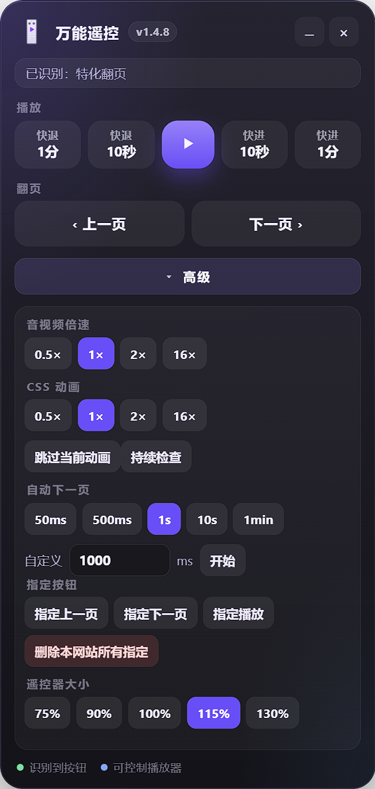

# 网页万能遥控

Edge / Chrome（Chromium）浏览器扩展：在网页上提供可拖拽的浮层遥控器，用于音视频快进快退、播放暂停，以及上一页 / 下一页。当前版本 **1.4.9**。本扩展按 Manifest V3 编写，在 **Google Chrome 与 Microsoft Edge 上同等支持**（未上架商店，均用「加载未打包的扩展」安装）。

> Universal Webpage Remote: a browser extension for Microsoft Edge and Chrome. It can seek and pause audio, video, and animations, handle various kinds of in-page navigation, and run automation. It prefers simulating the site's own interactions first, and includes specialized handling for certain scenarios.

优先模拟点击页面上已有的按钮；找不到时**不会**因为连点遥控而强制跳过。只有提示条里的「强制执行」才会走强制路径。

> [!WARNING]
> **使用强制跳过可能存在风险，请谨慎使用。**
>
> 「强制执行」**不会**点击页面原来的按钮，而是直接改页面结构或状态。这会绕过网站自己的步骤，例如校验、计数、接口回调、解锁条件等，可能导致页面显示与后台数据不一致，或其他异常。
>
> 日常请让遥控去点页面原按钮。强制功能只建议在你明确知道后果时使用。作者与贡献者不对误用强制执行造成的后果负责。

## 功能

- 快退 1 分钟 / 10 秒、播放暂停、快进 10 秒 / 1 分钟
- 上一页、下一页（优先点站内真实按钮；也识别「上一封 / 下一封」等）
- 绿点：识别到页面按钮；蓝点：可直接控制 HTML5 播放器
- 点对了也会提示：可「尝试其他可能按键」或「改为指定某按键」
- 高级：倍速（0.5 / 1 / 2 / 16）与自动下一页（间隔可调）
- 可拖拽、最小化、隐藏；工具栏图标可重新显示
- 报错提示可复制

## 场景特化

通用识别覆盖不了的页面，会走单独的适配。**目前已完成课件类页面**，以后还可能增加其它场景。  
识别条件、点击方式与限制见 [特化说明.md](./特化说明.md)，其它文档不再重复那些细节。

## 安装（未上架，加载未打包扩展）

Chrome 与 Edge 步骤相同，只是扩展页地址不同。

1. 克隆本仓库，或下载 ZIP 并解压  
2. 打开扩展页：Edge 为 `edge://extensions/`，Chrome 为 `chrome://extensions/`  
3. 打开「开发人员模式」（Chrome 在页面右上角，Edge 在左下角）  
4. 「加载解压缩的扩展」，选中本仓库根目录  
5. 打开扩展**详细信息**，将「网站访问」设为 **在所有网站上**（Chrome：Site access → On all sites）  
   - 若只允许「单击时」，跨域 iframe 里的内容无法操作  
6. 打开任意网页，左下角应出现「万能遥控」；版本号以浮层标题为准  

用 `file://` 打开 `demo.html` 时，请在扩展详情中允许访问文件网址。  
Chrome 无痕 / Edge InPrivate 需在详情里单独勾选允许。不支持 Firefox、Safari。更细的对照见 [安装说明.txt](./安装说明.txt)。

## 使用

- 拖标题栏移动；`–` 最小化，`×` 隐藏  
- 隐藏后点击浏览器工具栏里的扩展图标可再显示  
- 下一页：尽量点页面真实按钮，走网站原逻辑  
- 点播放 / 翻页后立刻显示「正在尝试」，完成后再换成结果  
- 操作成功但点错了：提示里选「尝试其他可能按键」，或「改为指定某按键」点一次正确按钮并记住（指定后若网页跳转，新页面仍会弹出结果，可再次改指定）  
- 高级里也可随时「指定上一页 / 下一页 / 播放」，或「删除本网站所有指定」  
- 不能指定遥控器自己的按钮；指定后会提示成功或失败
- 找不到按钮时，提示里还可选「强制执行（有风险）」  
- 「高级」顺序：音视频倍速 → CSS 动画 → 自动下一页 → 指定按钮 → 遥控器大小  

## 操作安全性评估

星级越高越相对安全，**不是**「可以随便用」。站点若自行校验进度或必做步骤，仍可能出错。

| 操作 | 安全星级 | 说明 |
|---|---|---|
| 音视频快进 / 倍速 | ★★☆☆☆ | 若站点有计时检查，可能导致错误 |
| 上一页 / 下一页 | ★★★☆☆ | 可能跳过必做步骤导致错误，但可以自行核对 |
| 强制翻页 | ★☆☆☆☆ | 极有可能造成错误 |
| 自动下一页 | ★★☆☆☆ | 过快可能跳过必做步骤，且来不及检查 |
| CSS 动画倍速 / 跳过 | ★★★★☆ | 后台几乎不会检查此类动画，一般不易出错 |

## 权限说明

- `<all_urls>`：在网页上显示遥控并操作按钮 / 播放器  
- `storage`：记住位置与是否隐藏  
- `webNavigation` / `scripting`：在子 frame 中查找并执行操作  

不会上传你的账号密码。强制跳过若触发了网站自己的接口，请求仍由**该网站**发出，请自行遵守网站使用条款。

## 预览

## 开发与维护

详见 [工程说明.md](./工程说明.md)。特化场景见 [特化说明.md](./特化说明.md)。

改代码后必须在扩展页点「重新加载」；含 iframe 的页面建议关掉标签再打开。

## 许可证

[MIT](./LICENSE)

## 免责声明

本项目按「现状」提供，用于个人学习与辅助浏览。使用本扩展即表示你理解：**使用强制跳过可能存在风险，请谨慎使用**；强制执行可能造成页面状态或数据异常，风险自负。请勿用于破坏服务条款或干扰他人系统。
